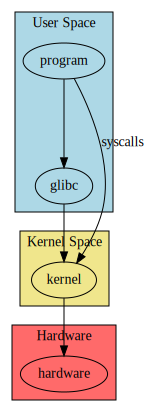

+++
title = "System Calls & strace"
slug = "2023-linux-trace"
#description = "a short description"

date = 2023-01-08
#updated = 2099-01-01

draft = false

[taxonomies]
tags = ["linux", "operating-systems"]
#authors = ["JB", "Alfred", "Nobel"]
+++

# Introduction
Programs interact with the operating system (kernel) via system calls or syscalls.



Syscalls are used to interact with:
* files: open, read, write, list
* network: open sockets, read, write
* memory: allocation, deallocation
* processes: creation, termination
* ...


# Tracing System Calls with `strace`
Tracing syscalls is done with the `strace` command

## Simple usage
You can run a simple command under `strace` like so

```shell-session
$ strace ls /etc/fstab
```

The output is pretty big, even for a simple command. It will contain the syscalls to get the attributes of the file (`statx`), and the syscall to write to stdout (`write`)

```
statx(AT_FDCWD, "/etc/fstab", AT_STATX_SYNC_AS_STAT|AT_NO_AUTOMOUNT, STATX_MODE, {stx_mask=STATX_BASIC_STATS|STATX_MNT_ID, stx_attributes=0, stx_mode=S_IFREG|0644, stx_size=503, ...}) = 0
statx(AT_FDCWD, "/etc/fstab", AT_STATX_SYNC_AS_STAT|AT_SYMLINK_NOFOLLOW|AT_NO_AUTOMOUNT, STATX_MODE, {stx_mask=STATX_BASIC_STATS|STATX_MNT_ID, stx_attributes=0, stx_mode=S_IFREG|0644, stx_size=503, ...}) = 0
write(1, "/etc/fstab\n", 11)            = 11
```

To get information on each syscall, you can check the manual

```shell-session
$ man statx
[...]
DESCRIPTION
       This function returns information about a file, storing it in the buffer pointed to by statxbuf.
```

## Advanced usage

Useful options include
* `-p <pid>`: specify PID to trace
* `-f`: also trace children
* `-e <syscall list>`: specify which syscall you want to trace
* `-tt`: add timestamps
* `-T`: add syscall duration

Open a first terminal, and get its PID
```shell-session
$ echo $$
9431
```

Open a second terminal, and trace the `clone`, `execve`, and `exit_group` syscall
```shell-session
$ strace -f -e clone,execve,exit_group -p 9431
strace: Process 9431 attached
```

Run a command in the first terminal, and check the output of `strace`
```shell-session
$ strace -f -e clone,execve,exit_group -p 9431
strace: Process 9431 attached
clone(child_stack=NULL, flags=CLONE_CHILD_CLEARTID|CLONE_CHILD_SETTID|SIGCHLD, child_tidptr=0x7f88f2f7ca10) = 10006
strace: Process 10006 attached
[pid 10006] execve("/usr/bin/ls", ["ls", "--color=auto"], 0x55abc5fd5280 /* 39 vars */) = 0
[pid 10006] exit_group(0)               = ?
[pid 10006] +++ exited with 0 +++
^C
strace: Process 9431 detached
```

1. `clone()` is used to clone the current (shell) process. The return value is the PID of the new process
1. `execve()` will load the executable specified as first argument, and create a new stack/heap in place
1. After `ls` has done its work, it exits with `exit_group`


# Conclusion
`strace` is a great tool to debug applications if you don't know their inner workings, or if you don't have any trace/log


# Sources & References
1. [Wikipedia - System call](https://en.wikipedia.org/wiki/System_call)
1. man strace