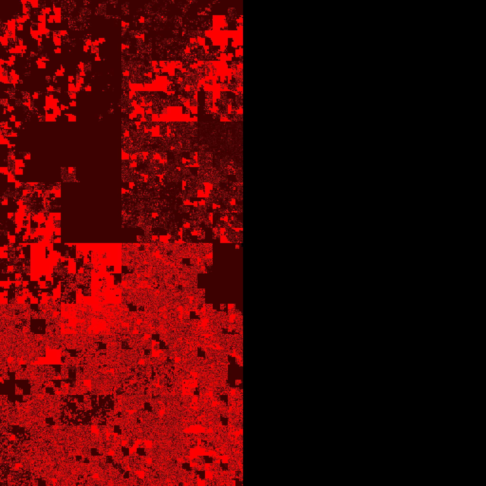

+++
title = "Linux Memory - Drop caches & Compact Memory"
slug = "2023-linux-memory-compact-drop-caches"
#description = "a short description"

date = 2023-02-03
#updated = 2099-01-01

draft = false

[taxonomies]
tags = ["linux", "memory"]
+++


# Intro

On Linux, memory is allocated by the buddy allocator. It allocates memory in chunks of sizes ranging from 4 kiB (a single page) to 4 MiB

We can inspect the available memory by chunk size with the pseudo-file `/proc/buddyinfo`. The first two lines indicate the size of each chunk, while the remaining lines indicate the number of available chunks:

```shell-session
$ cat /proc/buddyinfo 
power of 2               2^0    2^1    2^3    2^4    2^5    2^6    2^7    2^8    2^9   2^10   2^11
size (kiB)                 4      8     16     32     64    128    256    512   1024   2048   4096

Node 0, zone      DMA      0      0      0      0      0      0      0      0      0      1      3 
Node 0, zone    DMA32   6584   4336   2566   1463    770    435    231    125     83    168    407 
Node 0, zone   Normal  61346  38894  16324   4993   1241    353    150     80     47      3    112 
```

When a process claims memory, it is best if the buddy allocator can find a large enough chunks that fits the request.

Over time, the memory may become fragmented, and memory allocation will be less efficient: more small chunks will be available, at the expense of bigger chunks.

# Demo
## VM specs

Server is a virtual machine running in VirtualBox with 8192 "MB" of memory.

```shell-session
$ free -m
               total        used        free      shared  buff/cache   available
Mem:            7484        3284        4096          12         379        4200
Swap:           1999          39        1960

$ sudo cat /proc/iomem | grep RAM
00001000-0009fbff : System RAM
00100000-dffeffff : System RAM
100000000-21fffffff : System RAM
```

## Visual illustration

The following images were generated with the tool [`processes2png`](https://github.com/tatref/linux-mem/) from my Github.

* Each image shows the physical memory of the server
* Black pixels on the right side are outside of RAM due to aspect ratio
* Each pixel represents 1 page (1 kiB)
* Cache is not visible. Kernel memory is not visible. Shared memory is visible if at least one process has a handle to it
* Bright pixels are pixels referenced by a process and dark pixels are not referenced by any process.
* This is a Hilbert curve, it preserves locality; meaning that close addresses are close on the picture.

Initial state



After compacting memory


After dropping caches


After compacting memory again


# Sources & References
1. github.com/tatref- [linux-mem](https://github.com/tatref/linux-mem/)
1. docs.kernel.org - [Documentation for /proc/sys/vm/](https://docs.kernel.org/admin-guide/sysctl/vm.html)
1. Wikipedia - [Hilbert curve](https://en.wikipedia.org/wiki/Hilbert_curve)
1. grimoire.carcano.ch - [Memory Management – The Buddy Allocator](https://grimoire.carcano.ch/blog/memory-management-the-buddy-allocator/)